<div align="center">


<br>
<br>

# Diffusion-based World Models: A Survey

### A Living Survey, Curated Paper List, Taxonomy, Dataset Hub, and Research Roadmap

<p>
  <a href="https://arxiv.org/abs/2504.10724"></a>
  
  
  
  
</p>

<p>
  <a href="#-overview"><b>Overview</b></a> ·
  <a href="#-high-end-visuals"><b>Premium Visuals</b></a> ·
  <a href="#-original-paper-figures"><b>Original Figures</b></a> ·
  <a href="#-project-structure"><b>Project Structure</b></a> ·
  <a href="#-datasets--benchmarks"><b>Datasets</b></a> ·
  <a href="#-paper-list"><b>Paper List</b></a> ·
  <a href="#-citation"><b>Citation</b></a>
</p>

> **Toward controllable, interactive, and physically grounded world intelligence.**

</div>

---

## 📢 News

- **[2026]** We release this project-page-style GitHub repository for **Diffusion-based World Models**.
- **[2026]** The repository now includes **both original paper figures and redesigned premium visuals** for better presentation.
- **[2026]** The paper list currently covers **360+ references** spanning **2016–2026**.
- **[2026]** We organize the topic into **autonomous driving**, **embodied intelligence**, and **general-purpose worlds**.

---

## 🌐 Overview

World models aim to learn an internal simulator of the real world, enabling intelligent agents to **perceive**, **predict**, **imagine**, **reason**, **plan**, and **act**. Diffusion models have recently become a powerful foundation for world modeling because they support **multimodal generation**, **high-fidelity future synthesis**, **conditional controllability**, and **long-horizon imagination**.

This repository is designed in a **project page style** rather than a plain paper list. It provides:

<table>
<tr>
<td width="25%" align="center">

### 📚 Curated Paper List
A living collection of representative papers on diffusion-based world models and related foundations.

</td>
<td width="25%" align="center">

### 🧭 Unified Taxonomy
A structured map of tasks, domains, capabilities, datasets, and research trends.

</td>
<td width="25%" align="center">

### 🖼️ Visual Assets
Both paper-original figures and redesigned premium visuals for GitHub presentation.

</td>
<td width="25%" align="center">

### 🔭 Research Roadmap
A concise summary of open problems and future opportunities for the field.

</td>
</tr>
</table>


## 📄 Original Paper Figures

> Original figures preserved from the survey manuscript.

<div align="center">

<div style="width: 100%; margin-bottom: 16px;">
  <div style="width: 100%; background: #ffffff; border-radius: 12px; overflow: hidden; box-shadow: 0 4px 16px rgba(0,0,0,0.04);">
    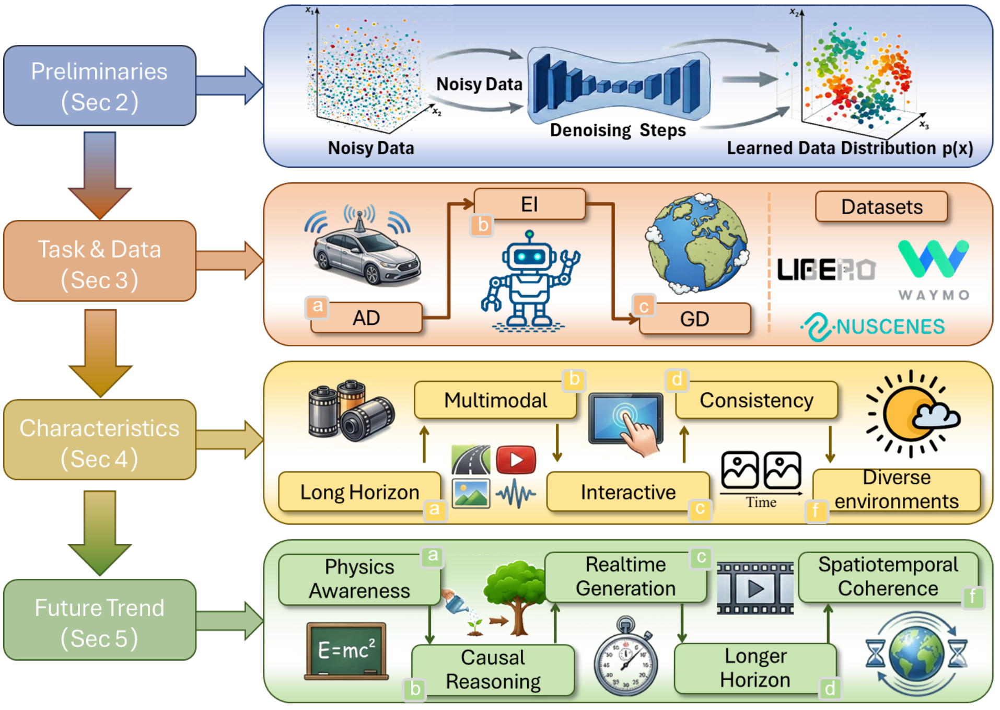
  </div>
</div>

<div style="width: 100%; margin-bottom: 16px;">
  <div style="width: 100%; background: #ffffff; border-radius: 12px; overflow: hidden; box-shadow: 0 4px 16px rgba(0,0,0,0.04);">
    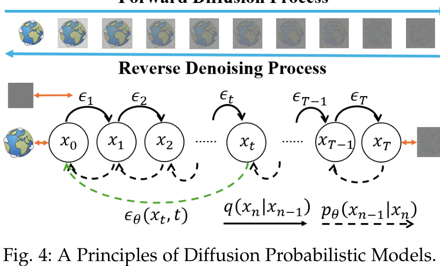
  </div>
</div>

<div style="width: 100%; margin-bottom: 16px;">
  <div style="width: 100%; background: #ffffff; border-radius: 12px; overflow: hidden; box-shadow: 0 4px 16px rgba(0,0,0,0.04);">
    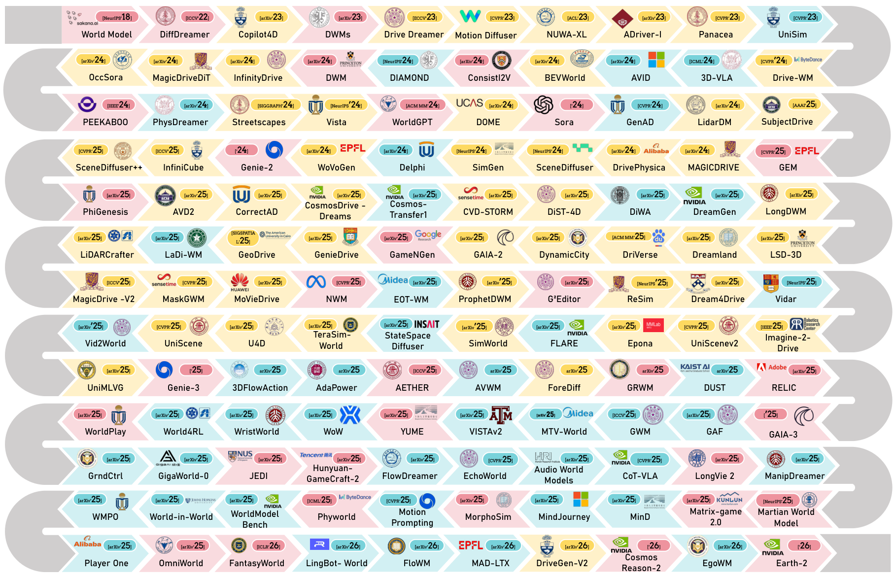
  </div>
</div>

<div style="width: 100%; margin-bottom: 16px;">
  <div style="width: 100%; background: #ffffff; border-radius: 12px; overflow: hidden; box-shadow: 0 4px 16px rgba(0,0,0,0.04);">
    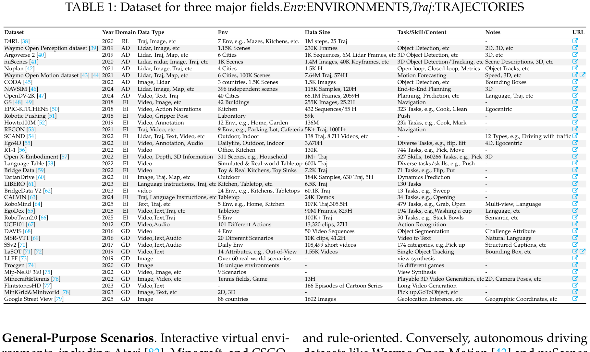
  </div>
</div>

</div>

---

## 🧠 Core Themes

| Theme | Description |
|---|---|
| **Autonomous Driving** | Driving scene generation, trajectory-conditioned simulation, occupancy/BEV forecasting, closed-loop planning, and long-tail scenario synthesis. |
| **Embodied Intelligence** | Action-conditioned prediction, robot manipulation, VLA reasoning, policy learning, sim-to-real transfer, and interactive imagination. |
| **General-purpose Worlds** | Long video generation, digital twins, game-like simulation, 3D/4D worlds, and scalable world foundation models. |
| **Key Capabilities** | Long-horizon evolution, multimodal fusion, interactivity, spatiotemporal consistency, and environment diversification. |
| **Open Problems** | Efficiency, controllability, causal reasoning, physical grounding, evaluation, and verification. |

---

## 🧪 Datasets & Benchmarks

| Domain | Representative Datasets |
|---|---|
| Autonomous Driving | nuScenes, Waymo, Argoverse 2, nuPlan, NAVSIM, OpenDV |
| Embodied Intelligence | Open X-Embodiment, RT-1, CALVIN, LIBERO, BridgeData, Ego4D |
| General-purpose Worlds | UCF101, MSR-VTT, SSv2, WebVid, Minecraft, Procgen, MiniGrid |

For a more organized summary, see:
- [`papers/datasets.md`](papers/datasets.md)
- [`resources/benchmarks.md`](resources/benchmarks.md)

---

## 🗂️ Project Structure

```text
root/
├── README.md
├── CONTRIBUTING.md
├── assets/
│   ├── project-page-preview.png
│   ├── dwm-banner-premium.png
│   ├── dwm-principle-premium.png
│   ├── dwm-original-figures-premium.png
│   ├── dwm-banner.png
│   ├── dwm-concept.png
│   ├── dwm-paper-galaxy.png
│   ├── dwm-datasets.png
│   └── paper_figures/
├── papers/
│   ├── README.md
│   ├── autonomous-driving.md
│   ├── embodied-intelligence.md
│   ├── general-worlds.md
│   └── datasets.md
└── resources/
    ├── README.md
    ├── awesome-world-models.md
    ├── benchmarks.md
    └── survey-notes.md
```

---

## 🗃️ Full Original Figure Gallery

<div align="center">

<div align="center">

<!-- 每行两张图，16:9 统一比例，图片完整显示不被裁剪 -->
<div style="display: flex; flex-wrap: wrap; justify-content: center; gap: 16px; margin-bottom: 12px;">
  <div style="flex: 0 0 calc(50% - 8px); max-width: calc(50% - 8px); min-width: 280px;">
    <div style="position: relative; width: 100%; padding-bottom: 56.25%; background: #ffffff; border-radius: 10px; overflow: hidden; box-shadow: 0 4px 12px rgba(0,0,0,0.03);">
      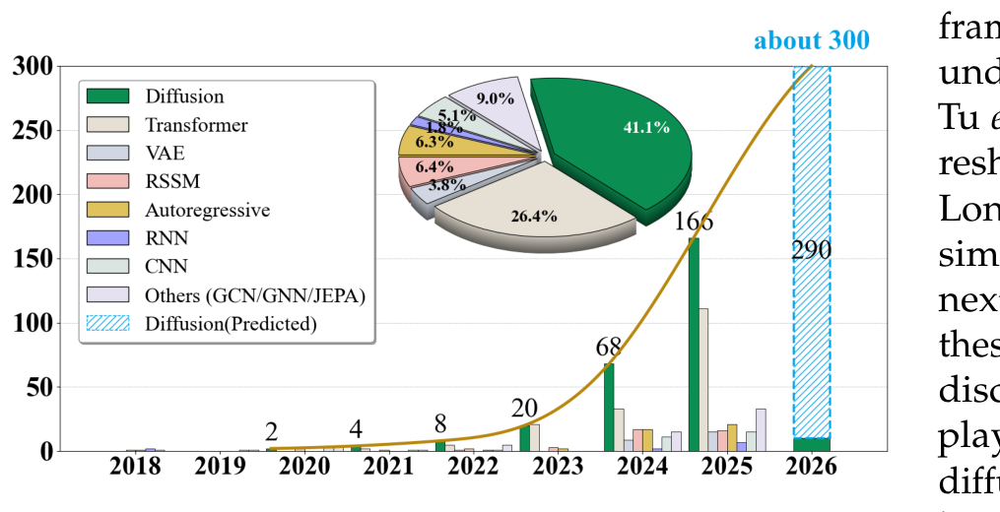
    </div>
  </div>
  <div style="flex: 0 0 calc(50% - 8px); max-width: calc(50% - 8px); min-width: 280px;">
    <div style="position: relative; width: 100%; padding-bottom: 56.25%; background: #ffffff; border-radius: 10px; overflow: hidden; box-shadow: 0 4px 12px rgba(0,0,0,0.03);">
      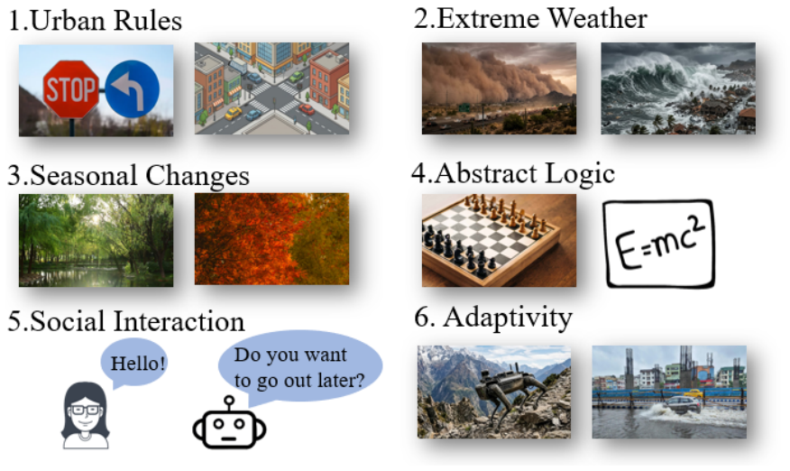
    </div>
  </div>
</div>


<div style="display: flex; flex-wrap: wrap; justify-content: center; gap: 16px; margin-bottom: 12px;">
  <div style="flex: 0 0 calc(50% - 8px); max-width: calc(50% - 8px); min-width: 280px;">
    <div style="position: relative; width: 100%; padding-bottom: 56.25%; background: #ffffff; border-radius: 10px; overflow: hidden; box-shadow: 0 4px 12px rgba(0,0,0,0.03);">
      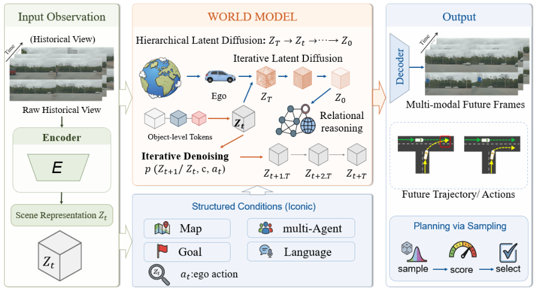
    </div>
  </div>
  <div style="flex: 0 0 calc(50% - 8px); max-width: calc(50% - 8px); min-width: 280px;">
    <div style="position: relative; width: 100%; padding-bottom: 56.25%; background: #ffffff; border-radius: 10px; overflow: hidden; box-shadow: 0 4px 12px rgba(0,0,0,0.03);">
      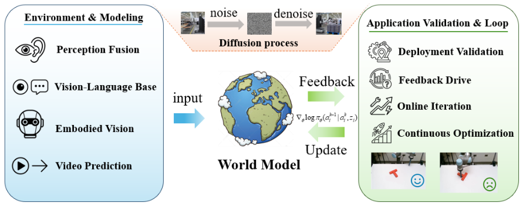
    </div>
  </div>
</div>

<div style="display: flex; flex-wrap: wrap; justify-content: center; gap: 16px; margin-bottom: 12px;">
  <div style="flex: 0 0 calc(50% - 8px); max-width: calc(50% - 8px); min-width: 280px;">
    <div style="position: relative; width: 100%; padding-bottom: 56.25%; background: #ffffff; border-radius: 10px; overflow: hidden; box-shadow: 0 4px 12px rgba(0,0,0,0.03);">
      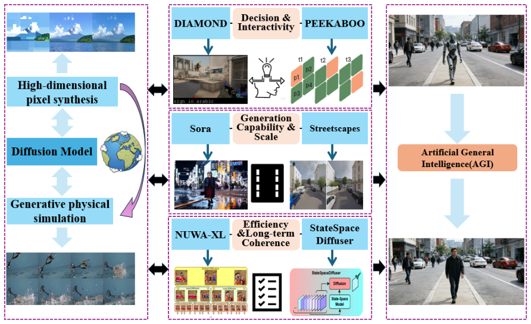
    </div>
  </div>
  <div style="flex: 0 0 calc(50% - 8px); max-width: calc(50% - 8px); min-width: 280px;">
    <div style="position: relative; width: 100%; padding-bottom: 56.25%; background: #ffffff; border-radius: 10px; overflow: hidden; box-shadow: 0 4px 12px rgba(0,0,0,0.03);">
      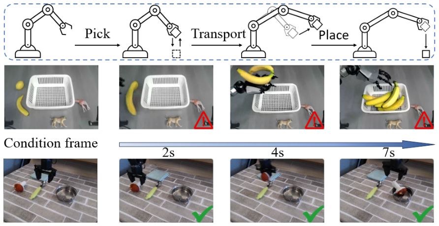
    </div>
  </div>
</div>

<div style="display: flex; flex-wrap: wrap; justify-content: center; gap: 16px; margin-bottom: 12px;">
  <div style="flex: 0 0 calc(50% - 8px); max-width: calc(50% - 8px); min-width: 280px;">
    <div style="position: relative; width: 100%; padding-bottom: 56.25%; background: #ffffff; border-radius: 10px; overflow: hidden; box-shadow: 0 4px 12px rgba(0,0,0,0.03);">
      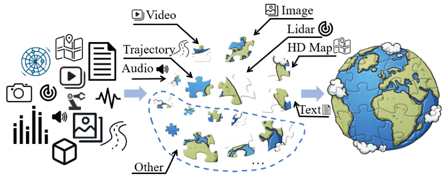
    </div>
  </div>
  <div style="flex: 0 0 calc(50% - 8px); max-width: calc(50% - 8px); min-width: 280px;">
    <div style="position: relative; width: 100%; padding-bottom: 56.25%; background: #ffffff; border-radius: 10px; overflow: hidden; box-shadow: 0 4px 12px rgba(0,0,0,0.03);">
      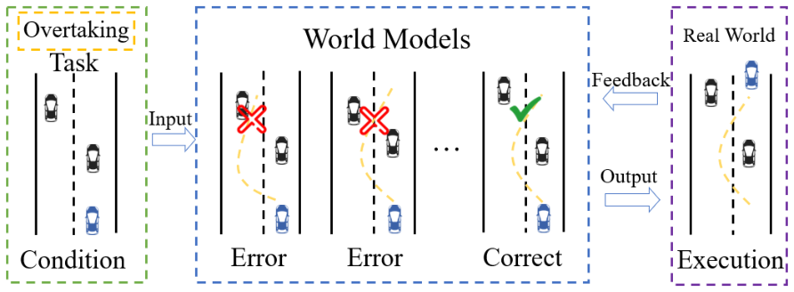
    </div>
  </div>
</div>

<div style="display: flex; flex-wrap: wrap; justify-content: center; gap: 16px; margin-bottom: 12px;">
  <div style="flex: 0 0 calc(50% - 8px); max-width: calc(50% - 8px); min-width: 280px;">
    <div style="position: relative; width: 100%; padding-bottom: 56.25%; background: #ffffff; border-radius: 10px; overflow: hidden; box-shadow: 0 4px 12px rgba(0,0,0,0.03);">
      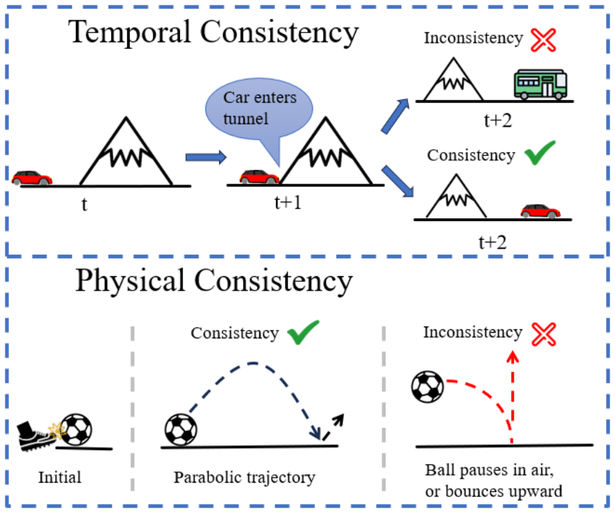
    </div>
  </div>
  <div style="flex: 0 0 calc(50% - 8px); max-width: calc(50% - 8px); min-width: 280px;">
    <div style="position: relative; width: 100%; padding-bottom: 56.25%; background: #ffffff; border-radius: 10px; overflow: hidden; box-shadow: 0 4px 12px rgba(0,0,0,0.03);">
      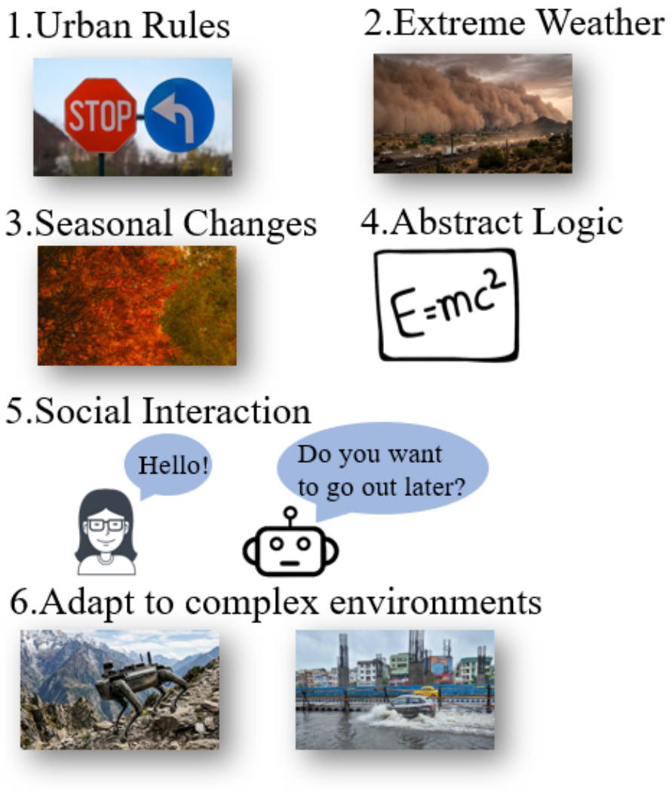
    </div>
  </div>
</div>


</div>

---

## 🤝 Contributing

We warmly welcome contributions. You can help by:

- adding missing papers,
- correcting metadata,
- supplementing code / project links,
- improving taxonomy or tags,
- refining dataset and benchmark summaries.

Please see [`CONTRIBUTING.md`](CONTRIBUTING.md) for details.

---

## 📚 Paper Navigation

For category-wise browsing, see:

- [`papers/README.md`](papers/README.md)
- [`papers/autonomous-driving.md`](papers/autonomous-driving.md)
- [`papers/embodied-intelligence.md`](papers/embodied-intelligence.md)
- [`papers/general-worlds.md`](papers/general-worlds.md)
- [`papers/datasets.md`](papers/datasets.md)

---

## 📌 Citation

```bibtex
@article{wang2026diffusionworldmodels,
  title   = {Diffusion-based World Models: A Survey},
  author  = {Wang, Gang and Liu, Zhen and Zhou, Mingliang and Zhang, Yugui and Yang, Guang and Yang, Lei and Song, Ziying},
  journal = {arXiv preprint arXiv:2504.10724},
  year    = {2026}
}
```

---

# 📑 Paper List

The following paper list is continuously updated. We welcome pull requests for missing papers, code links, project pages, datasets, and benchmark resources.

## 📑 Year Directory

- [2026](#2026)
- [2025](#2025)
- [2024](#2024)
- [2023](#2023)
- [2022](#2022)
- [2021](#2021)
- [2020](#2020)
- [2019](#2019)
- [2018](#2018)
- [2016](#2016)

---

## 2026
- **VerseCrafter: Dynamic Realistic Video World Model with 4D Geometric Control** | [Paper](https://arxiv.org/abs/2601.05138) | [Code](https://github.com/TencentARC/VerseCrafter)
- **NeoVerse: Enhancing 4D World Model with in-the-wild Monocular Videos** | [Paper](https://arxiv.org/abs/2601.00393) | [Code](https://github.com/IamCreateAI/NeoVerse)
- **LongStream: Long-Sequence Streaming Autoregressive Visual Geometry** | [Paper](https://arxiv.org/abs/2602.13172) | [Code](https://github.com/3DAgentWorld/LongStream)
- **VideoWorld 2: Learning Transferable Knowledge from Real-world Videos** | [Paper](https://arxiv.org/abs/2602.10102)
- **ProPhy: Progressive Physical Alignment for Dynamic World Simulation** | [Paper](https://arxiv.org/abs/2512.05564) | [Code](https://github.com/zijunwa/ProPhy)
- **Chain of Event-Centric Causal Thought for Physically Plausible Video Generation** | [Paper](https://arxiv.org/abs/2603.09094)
- **Taming Video Models for 3D and 4D Generation via Zero-Shot Camera Control** | [Paper](https://arxiv.org/abs/2509.15130)
- **DriveLaW:Unifying Planning and Video Generation in a Latent Driving World** | [Paper](https://arxiv.org/abs/2512.23421) | [Code](https://github.com/xiaomi-research/drivelaw)
- **ABot-PhysWorld: Interactive World Foundation Model for Robotic Manipulation with Physics Alignment** | [Paper](https://arxiv.org/abs/2603.23376)
- **SimScale: Learning to Drive via Real-World Simulation at Scale** | [Paper](https://arxiv.org/abs/2511.23369)
- **4DWorldBench: A Comprehensive Evaluation Framework for 3D/4D World Generation Models** | [Paper](https://arxiv.org/abs/2511.19836)
- **WorldLens:Full-Spectrum Evaluations of Driving World Models in Real World** | [Paper](https://arxiv.org/html/2512.10958v1) | [Code](https://github.com/worldbench/WorldLens)
- **GeoWorld: Geometric World Models** | [Paper](https://arxiv.org/abs/2602.23058) | [Code](https://github.com/steve-zeyu-zhang/GeoWorld)
- **Free-Lunch Long Video Generation via Layer-Adaptive O.O.D Correction** | [Paper](https://arxiv.org/abs/2603.25209) | [Code](https://github.com/Westlake-AGI-Lab/FreeLOC)
- **Astra: General interactive world model with autoregressive denoising** | [Paper](https://arxiv.org/abs/2512.08931) | [Code](https://github.com/EternalEvan/Astra)
- **seq-JEPA: Autoregressive Predictive Learning of Invariant-Equivariant World Models** | [Paper](https://arxiv.org/abs/2505.03176) | [Code](https://github.com/hafezgh/seq-jepa)

---

## 2025
- **UniWorld-V1: High-Resolution Semantic Encoders for Unified Visual Understanding and Generation** | [Paper](https://arxiv.org/abs/2506.03147)
- **MagicDrive-V2: High-Resolution Long Video Generation for Autonomous Driving with Adaptive Control** | [Paper](https://arxiv.org/abs/2411.13807) | [Code](https://github.com/flymin/MagicDrive-V2)
- **VLM-SAFE: Vision-Language Model-Guided Safety-Aware Reinforcement Learning with World Models for Autonomous Driving** | [Paper](https://arxiv.org/abs/2505.16377) | [Code](https://github.com/ys-qu/vlm-safe)
- **Statespacediffuser: Bringing long context to diffusion world models** | [Paper](https://arxiv.org/abs/2505.22246)
- **Understanding world or predicting future? a comprehensive survey of world models** | [Paper](https://arxiv.org/abs/2411.14499)
- **The role of world models in shaping autonomous driving: A comprehensive survey** | [Paper](https://arxiv.org/abs/2502.10498)
- **A survey: Learning embodied intelligence from physical simulators and world models** | [Paper](https://arxiv.org/abs/2507.00917)
- **I think, therefore i diffuse: Enabling multimodal in-context reasoning in diffusion models** | [Paper](https://arxiv.org/abs/2502.10458) | [Code](https://github.com/MiZhenxing/ThinkDiff)
- **Vidar: Embodied video diffusion model for generalist manipulation** | [Paper](https://arxiv.org/abs/2507.12898)
- **Epona: Autoregressive diffusion world model for autonomous driving** | [Paper](https://arxiv.org/abs/2506.24113) | [Code](https://github.com/Kevin-thu/Epona)
- **Gaia-2: A controllable multi-view generative world model for autonomous driving** | [Paper](https://arxiv.org/abs/2503.20523)
- **Cosmos-drive-dreams: Scalable synthetic driving data generation with world foundation models** | [Paper](https://arxiv.org/abs/2506.09042) | [Code](https://github.com/nv-tlabs/Cosmos-Drive-Dreams)
- **Avd2: Accident video diffusion for accident video description** | [Paper](https://arxiv.org/abs/2502.14801) | [Code](https://github.com/An-Answer-tree/AVD2)
- **Cvd-storm: Cross-view video diffusion with spatial-temporal reconstruction model for autonomous driving** | [Paper](https://arxiv.org/abs/2510.07944)
- **Dive: Efficient multi-view driving scenes generation based on video diffusion transformer** | [Paper](https://arxiv.org/abs/2504.19614)
- **Dist-4d: Disentangled spatiotemporal diffusion with metric depth for 4d driving scene generation** | [Paper](https://arxiv.org/abs/2503.15208) | [Code](https://github.com/royalmelon0505/dist4d)
- **Dreamland: Controllable world creation with simulator and generative models** | [Paper](https://arxiv.org/abs/2506.08006)
- **Drive&gen: Co-evaluating end-to-end driving and video generation models** | [Paper](https://arxiv.org/abs/2510.06209)
- **Driverse: Navigation world model for driving simulation via multimodal trajectory prompting and motion alignment** | [Paper](https://arxiv.org/abs/2504.18576) | [Code](https://github.com/shalfun/DriVerse)
- **Dynamiccity: Large-scale 4d occupancy generation from dynamic scenes** | [Paper](https://arxiv.org/abs/2410.18084) | [Code](https://github.com/3DTopia/DynamicCity)
- **Lidarcrafter: Dynamic 4d world modeling from lidar sequences** | [Paper](https://arxiv.org/abs/2508.03692) | [Code](https://github.com/worldbench/LiDARCrafter)
- **Mila: Multi-view intensive-fidelity long-term video generation world model for autonomous driving** | [Paper](https://arxiv.org/abs/2503.15875)
- **Maskgwm: A generalizable driving world model with video mask reconstruction** | [Paper](https://arxiv.org/abs/2502.11663)
- **Orbis: Overcoming challenges of long-horizon prediction in driving world models** | [Paper](https://arxiv.org/abs/2507.13162) | [Code](https://github.com/lmb-freiburg/orbis.github.io)
- **Scenediffuser++: City-scale traffic simulation via a generative world model** | [Paper](https://arxiv.org/abs/2506.21976)
- **Uniscene: Unified occupancy-centric driving scene generation** | [Paper](https://arxiv.org/abs/2412.05435) | [Code](https://github.com/Arlo0o/UniScene-Unified-Occupancy-centric-Driving-Scene-Generation)
- **Imagine-2-drive: Leveraging high-fidelity world models via multi-modal diffusion policies** | [Paper](https://arxiv.org/abs/2411.10171)
- **Imagidrive: A unified imagination-and-planning framework for autonomous driving** | [Paper](https://arxiv.org/abs/2508.11428) | [Code](https://github.com/fudan-zvg/ImagiDrive)
- **UniFuture: A 4D Driving World Model for Future Generation and Perception** | [Paper](https://arxiv.org/abs/2503.13587) | [Code](https://github.com/dk-liang/UniFuture)
- **Cosmos-transfer1: Conditional world generation with adaptive multimodal control** | [Paper](https://arxiv.org/abs/2503.14492) | [Code](https://github.com/NVIDIA/Cosmos)
- **Cosmos World Foundation Model Platform for Physical AI** | [Paper](https://arxiv.org/abs/2501.03575) | [Code](https://github.com/NVIDIA/Cosmos)
- **Diwa: Diffusion policy adaptation with world models** | [Paper](https://arxiv.org/abs/2508.03645) | [Code](https://github.com/acl21/diwa)
- **Dreamgen: Unlocking generalization in robot learning through video world models** | [Paper](https://arxiv.org/abs/2505.12705)
- **Ladi-wm: A latent diffusion-based world model for predictive manipulation** | [Paper](https://arxiv.org/abs/2505.11528)
- **Navigation world models** | [Paper](https://arxiv.org/abs/2412.03572) | [Code](https://github.com/facebookresearch/nwm)
- **Vid2world: Crafting video diffusion models to interactive world models** | [Paper](https://arxiv.org/abs/2505.14357) | [Code](https://github.com/thuml/Vid2World)
- **Cot-vla: Visual chain-of-thought reasoning for vision-language-action models** | [Paper](https://arxiv.org/abs/2503.22020)
- **Ctrl-world: A controllable generative world model for robot manipulation** | [Paper](https://arxiv.org/abs/2510.10125)
- **Echoworld: Learning motion-aware world models for echocardiography probe guidance** | [Paper](https://arxiv.org/abs/2504.13065) | [Code](https://github.com/LeapLabTHU/EchoWorld)
- **Flare: Robot learning with implicit world modeling** | [Paper](https://arxiv.org/abs/2505.15659)
- **Gwm: Towards scalable gaussian world models for robotic manipulation** | [Paper](https://arxiv.org/abs/2508.17600)
- **Keyworld: Key frame reasoning enables effective and efficient world models** | [Paper](https://arxiv.org/abs/2509.21027)
- **Longscape: Advancing long-horizon embodied world models with context-aware moe** | [Paper](https://arxiv.org/abs/2509.21790)
- **Mind: Learning a dual-system world model for real-time planning and implicit risk analysis** | [Paper](https://arxiv.org/abs/2506.18897)
- **Mindjourney: Test-time scaling with world models for spatial reasoning** | [Paper](https://arxiv.org/abs/2507.12508) | [Code](https://github.com/UMass-Embodied-AGI/MindJourney)
- **Mowm: Mixture-of-world-models for embodied planning via latent-to-pixel feature modulation** | [Paper](https://arxiv.org/abs/2509.21797)
- **Playerone: Egocentric world simulator** | [Paper](https://arxiv.org/abs/2506.09995) | [Code](https://github.com/yuanpengtu/PlayerOne)
- **Vistav2: World imagination for indoor vision-and-language navigation** | [Paper](https://arxiv.org/abs/2512.00041)
- **Whole-body conditioned egocentric video prediction** | [Paper](https://arxiv.org/abs/2506.21552)
- **Wmpo: World model-based policy optimization for vision-language-action models** | [Paper](https://arxiv.org/abs/2511.09515) | [Code](https://github.com/WM-PO/WMPO)
- **World4rl: Diffusion world models for policy refinement with reinforcement learning for robotic manipulation** | [Paper](https://arxiv.org/abs/2509.19080)
- **World-in-world: World models in a closed-loop world** | [Paper](https://arxiv.org/abs/2510.18135) | [Code](https://github.com/World-In-World/world-in-world)
- **Motion prompting: Controlling video generation with motion trajectories** | [Paper](https://arxiv.org/abs/2412.02700)
- **Storyweaver: A unified world model for knowledge-enhanced story character customization** | [Paper](https://arxiv.org/abs/2412.07375) | [Code](https://github.com/Aria-Zhangjl/StoryWeaver)
- **Aether: Geometric-aware unified world modeling** | [Paper](https://arxiv.org/abs/2503.18945) | [Code](https://github.com/InternRobotics/Aether)
- **Jedi: Latent end-to-end diffusion mitigates agent-human performance asymmetry in model-based reinforcement learning** | [Paper](https://www.researchgate.net/publication/392106038_JEDI_Latent_End-to-end_Diffusion_Mitigates_Agent-Human_Performance_Asymmetry_in_Model-Based_Reinforcement_Learning)
- **Long-context state-space video world models** | [Paper](https://arxiv.org/abs/2505.20171)
- **Longvie 2: Multimodal controllable ultra-long video world model** | [Paper](https://arxiv.org/abs/2512.13604)
- **Martian world model: Controllable video synthesis with physically accurate 3d reconstructions** | [Paper](https://arxiv.org/abs/2507.07978)
- **Model as a game: On numerical and spatial consistency for generative games** | [Paper](https://arxiv.org/abs/2503.21172)
- **Morphosim: An interactive, controllable, and editable language-guided 4d world simulator** | [Paper](https://arxiv.org/abs/2510.04390)
- **Omniworld: A multi-domain and multi-modal dataset for 4d world modeling** | [Paper](https://arxiv.org/abs/2509.12201) | [Code](https://github.com/yangzhou24/OmniWorld)
- **Pre-trained video generative models as world simulators** | [Paper](https://arxiv.org/abs/2502.07825)
- **Simulating before planning: Constructing intrinsic user world model for user-tailored dialogue policy planning** | [Paper](https://arxiv.org/abs/2504.13643)
- **Terra: Explorable native 3d world model with point latents** | [Paper](https://arxiv.org/abs/2510.14977)
- **Voyager: Long-range and world-consistent video diffusion for explorable 3d scene generation** | [Paper](https://arxiv.org/abs/2506.04225)
- **Yume: An interactive world generation model** | [Paper](https://arxiv.org/abs/2507.17744)
- **Fantasyworld: Geometry-consistent world modeling via unified video and 3d prediction** | [Paper](https://arxiv.org/abs/2509.21657) | [Code](https://github.com/Fantasy-AMAP/fantasy-world)
- **π0.5: a vision-language-action model with open-world generalization** | [Paper](https://arxiv.org/abs/2504.16054)
- **Open x-embodiment: Robotic learning datasets and rt-x models** | [Paper](https://arxiv.org/abs/2310.08864) | [Code](https://github.com/google-deepmind/open_x_embodiment) | [Dataset](https://opendatalab.org.cn/OpenDataLab/OpenX-Embodiment)
- **Egodex: Learning dexterous manipulation from large-scale egocentric video** | [Paper](https://arxiv.org/abs/2505.11709) | [Code](https://github.com/apple/ml-egodex)
- **Robomind: Benchmark on multi-embodiment intelligence normative data for robot manipulation** | [Paper](https://arxiv.org/abs/2412.13877)
- **Robotwin 2.0: A scalable data generator and benchmark with strong domain randomization for robust bimanual robotic manipulation** | [Paper](https://arxiv.org/abs/2506.18088)
- **Evaluating precise geolocation inference capabilities of vision language models** | [Paper](https://arxiv.org/abs/2502.14412)
- **Diffuse and disperse: Image generation with representation regularization** | [Paper](https://arxiv.org/abs/2506.09027)
- **CorrectAD: A Self-Correcting Agentic System to Improve End-to-end Planning in Autonomous Driving** | [Paper](https://arxiv.org/abs/2511.13297)
- **4D Driving Scene Generation With Stereo Forcing** | [Paper](https://arxiv.org/abs/2509.20251)
- **CoGen: 3D Consistent Video Generation via Adaptive Conditioning for Autonomous Driving** | [Paper](https://arxiv.org/abs/2503.22231)
- **UniMLVG: Unified Framework for Multi-view Long Video Generation with Comprehensive Control Capabilities for Autonomous Driving** | [Paper](https://arxiv.org/abs/2412.04842)
- **Genie 3** | [Paper](https://deepmind.google/models/genie/) | [Code](https://github.com/vahuynh/GENIE3)
- **3DFlowAction: Learning Cross-Embodiment Manipulation from 3D Flow World Model** | [Paper](https://arxiv.org/abs/2506.06199)
- **A Good Regulator May Provide a World Model for Intelligent Systems** | [Paper](https://arxiv.org/abs/2506.23032)
- **AdaPower: Specializing World Foundation Models for Predictive Manipulation** | [Paper](https://arxiv.org/abs/2512.03538)
- **Bridging the Gap Between Multimodal Foundation Models and World Models** | [Paper](https://arxiv.org/abs/2510.03727)
- **Bootstrapping World Models from Dynamics Models in Multimodal Foundation Models** | [Paper](https://arxiv.org/abs/2506.06006) | [Code](https://github.com/yfqiu-nlp/vlm-world-model)
- **Consistent World Models via Foresight Diffusion** | [Paper](https://arxiv.org/pdf/2505.16474v1)
- **Clone Deterministic 3D Worlds with Geometrically-Regularized World Models** | [Paper](https://arxiv.org/abs/2510.26782)
- **Counterfactual World Models via Digital Twin-conditioned Video Diffusion** | [Paper](https://arxiv.org/abs/2511.17481)
- **FlowDreamer: A RGB-D World Model with Flow-based Motion Representations for Robot Manipulation** | [Paper](https://arxiv.org/abs/2505.10075) | [Code](https://github.com/sharinka0715/FlowDreamer)
- **GAF: Gaussian Action Field as a Dynamic World Model for Robotic Manipulation** | [Paper](https://arxiv.org/abs/2506.14135) | [Code](https://github.com/ChaiYing1/GAF)
- **Generative World Modelling for Humanoids: 1X World Model Challenge Technical Report** | [Paper](https://arxiv.org/abs/2510.07092)
- **GigaWorld-0: World Models as Data Engine to Empower Embodied AI** | [Paper](https://arxiv.org/abs/2511.19861) | [Code](https://github.com/open-gigaai/giga-world-0)
- **GrndCtrl: Grounding World Models via Self-Supervised Reward Alignment** | [Paper](https://arxiv.org/abs/2512.01952)
- **HERO: Hierarchical Extrapolation and Refresh for Efficient World Models** | [Paper](https://arxiv.org/abs/2508.17588)
- **Hunyuan-GameCraft-2: Instruction-following Interactive Game World Model** | [Paper](https://arxiv.org/abs/2511.23429)
- **HunyuanWorld 1.0: Generating Immersive, Explorable, and Interactive 3D Worlds from Words or Pixels** | [Paper](https://arxiv.org/abs/2507.21809)
- **Audio-Visual World Models: Towards Multisensory Imagination in Sight and Sound** | [Paper](https://arxiv.org/abs/2512.00883)
- **ManipDreamer: Boosting Robotic Manipulation World Model with Action Tree and Visual Guidance** | [Paper](https://arxiv.org/abs/2504.16464)
- **Matrix-Game 2.0: An Open-Source, Real-Time, and Streaming Interactive World Model** | [Paper](https://arxiv.org/abs/2508.13009) | [Code](https://github.com/ZacharyBroveak/Matrix-Game)
- **Memory Forcing: Spatio-Temporal Memory for Consistent Scene Generation on Minecraft** | [Paper](https://arxiv.org/abs/2510.03198) | [Code](https://github.com/Junchao-cs/Memory-Forcing)
- **Motus: A Unified Latent Action World Model** | [Paper](https://arxiv.org/abs/2512.13030) | [Code](https://github.com/thu-ml/Motus)
- **NORA-1.5: A Vision-Language-Action Model Trained using World Model- and Action-based Preference Rewards** | [Paper](https://arxiv.org/abs/2511.14659) | [Code](https://github.com/declare-lab/nora-1.5)
- **ORV: 4D Occupancy-centric Robot Video Generation** | [Paper](https://arxiv.org/abs/2506.03079) | [Code](https://github.com/OrangeSodahub/ORV)
- **PhysicalAgent: Towards General Cognitive Robotics with Foundation World Models** | [Paper](https://arxiv.org/abs/2509.13903)
- **Probing the effectiveness of World Models for Spatial Reasoning through Test-time Scaling** | [Paper](https://arxiv.org/abs/2512.05809)
- **RELIC: Interactive Video World Model with Long-Horizon Memory** | [Paper](https://arxiv.org/abs/2512.04040)
- **Remote Sensing-Oriented World Model** | [Paper](https://arxiv.org/abs/2509.17808)
- **Scalable Policy Evaluation with Video World Models** | [Paper](https://arxiv.org/abs/2511.11520)
- **Semantic Communications with World Models** | [Paper](https://arxiv.org/abs/2510.24785)
- **TesserAct: Learning 4D Embodied World Models** | [Paper](https://arxiv.org/abs/2504.20995) | [Code](https://github.com/UMass-Embodied-AGI/TesserAct)
- **Toward Stable World Models: Measuring and Addressing World Instability in Generative Environments** | [Paper](https://arxiv.org/abs/2503.08122)
- **MTV-World: Towards High-Consistency Embodied World Model with Multi-View Trajectory Videos** | [Paper](https://arxiv.org/abs/2511.12882)
- **Unified World Models: Coupling Video and Action Diffusion for Pretraining on Large Robotic Datasets** | [Paper](https://arxiv.org/abs/2504.02792) | [Code](https://github.com/WEIRDLabUW/unified-world-model)
- **WorldPlanner: Monte Carlo Tree Search and MPC with Action-Conditioned Visual World Models** | [Paper](https://arxiv.org/abs/2511.03077)
- **WorldPlay: Towards Long-Term Geometric Consistency for Real-Time Interactive World Modeling** | [Paper](https://arxiv.org/abs/2512.14614)
- **WoW: Towards a World omniscient World model Through Embodied Interaction** | [Paper](https://arxiv.org/abs/2509.22642)
- **WristWorld: Generating Wrist-Views via 4D World Models for Robotic Manipulation** | [Paper](https://arxiv.org/abs/2510.07313)
- **NRSeg: Noise-Resilient Learning for BEV Semantic Segmentation via Driving World Models** | [Paper](https://arxiv.org/abs/2507.04002)
- **OpenTwinMap: An Open-Source Digital Twin Generator for Urban Autonomous Driving** | [Paper](https://arxiv.org/abs/2511.21925)
- **Unlocking Efficient Vehicle Dynamics Modeling via Analytic World Models** | [Paper](https://arxiv.org/abs/2502.10012)
- **Deterministic World Models for Verification of Closed-loop Vision-based Systems** | [Paper](https://arxiv.org/abs/2512.08991)
- **Dynamic Sparsity: Challenging Common Sparsity Assumptions for Learning World Models in Robotic Reinforcement Learning Benchmarks** | [Paper](https://arxiv.org/abs/2511.08086)
- **ProTerrain: Probabilistic Physics-Informed Rough Terrain World Modeling** | [Paper](https://arxiv.org/abs/2510.19364)
- **Simple, Good, Fast: Self-Supervised World Models Free of Baggage** | [Paper](https://arxiv.org/abs/2506.02612)
- **Advancing Semantic Future Prediction through Multimodal Visual Sequence Transformers** | [Paper](https://arxiv.org/abs/2501.08303) | [Code](https://github.com/Sta8is/FUTURIST)
- **Delta-Triplane Transformers as Occupancy World Models** | [Paper](https://arxiv.org/abs/2503.07338)
- **DriveVLA-W0: World Models Amplify Data Scaling Law in Autonomous Driving** | [Paper](https://arxiv.org/abs/2510.12796) | [Code](https://github.com/BraveGroup/DriveVLA-W0)
- **DriveX: Omni Scene Modeling for Learning Generalizable World Knowledge in Autonomous Driving** | [Paper](https://arxiv.org/abs/2505.19239)
- **FASTopoWM: Fast-Slow Lane Segment Topology Reasoning with Latent World Models** | [Paper](https://arxiv.org/abs/2507.23325)
- **From Forecasting to Planning: Policy World Model for Collaborative State-Action Prediction** | [Paper](https://arxiv.org/abs/2510.19654) | [Code](https://github.com/6550Zhao/Policy-World-Model)
- **FutureSightDrive: Thinking Visually with Spatio-Temporal CoT for Autonomous Driving** | [Paper](https://arxiv.org/abs/2505.16509) | [Code](https://github.com/MIV-XJTU/FSDrive)
- **I²-World: Intra-Inter Tokenization for Efficient Dynamic 4D Scene Forecasting** | [Paper](https://arxiv.org/abs/2507.09144)
- **Latent Chain-of-Thought World Modeling for End-to-End Autonomous Driving** | [Paper](https://arxiv.org/abs/2512.10226)
- **MineWorld: a Real-Time and Open-Source Interactive World Model on Minecraft** | [Paper](https://arxiv.org/abs/2504.08388) | [Code](https://github.com/MineWorld-125/MineWorld)
- **OccProphet: Pushing Efficiency Frontier of Camera-Only 4D Occupancy Forecasting** | [Paper](https://arxiv.org/abs/2502.15180) | [Code](https://github.com/JLChen-C/OccProphet)
- **OccTENS: 3D Occupancy World Model via Temporal Next-Scale Prediction** | [Paper](https://arxiv.org/abs/2509.03887)
- **OmniNWM: Omniscient Driving Navigation World Models** | [Paper](https://arxiv.org/abs/2510.18313) | [Code](https://github.com/Ma-Zhuang/OmniNWM)
- **SparseWorld-TC: Trajectory-Conditioned Sparse Occupancy World Model** | [Paper](https://arxiv.org/abs/2511.22039) | [Code](https://github.com/MrPicklesGG/SparseWorld-TC)
- **STAGE: A Stream-Centric Generative World Model for Long-Horizon Driving-Scene Simulation** | [Paper](https://arxiv.org/abs/2506.13138)
- **Think Before You Drive: World Model-Inspired Multimodal Grounding for Autonomous Vehicles** | [Paper](https://arxiv.org/abs/2512.03454)
- **VaViM and VaVAM: Autonomous Driving through Video Generative Modeling** | [Paper](https://arxiv.org/abs/2502.15672) | [Code](https://github.com/valeoai/VideoActionModel)
- **VGGT-World: Transforming VGGT into an Autoregressive Geometry World Model** | [Paper](https://arxiv.org/abs/2603.12655)
- **World4Drive: End-to-End Autonomous Driving via Intention-aware Physical Latent World Model** | [Paper](https://arxiv.org/abs/2507.00603)
- **GenieDrive: Towards Physics-Aware Driving World Model with 4D Occupancy Guided Video Generation** | [Paper](https://arxiv.org/abs/2512.12751) | [Code](https://github.com/Huster-YZY/GenieDrive)
- **GeoDrive: 3D Geometry-Informed Driving World Model with Precise Action Control** | [Paper](https://arxiv.org/abs/2505.22421)
- **LongDWM: Cross-Granularity Distillation for Building a Long-Term Driving World Model** | [Paper](https://arxiv.org/abs/2506.01546) | [Code](https://github.com/Wang-Xiaodong1899/Long-DWM)
- **MoVieDrive: Urban Scene Synthesis with Multi-Modal Multi-View Video Diffusion Transformer** | [Paper](https://arxiv.org/abs/2508.14327)
- **Other Vehicle Trajectories Are Also Needed: A Driving World Model Unifies Ego-Other Vehicle Trajectories in Video Latent Space** | [Paper](https://arxiv.org/abs/2503.09215)
- **ProphetDWM: A Driving World Model for Rolling Out Future Actions and Videos** | [Paper](https://arxiv.org/abs/2505.18650)
- **Realistic and Controllable 3D Gaussian-Guided Object Editing for Driving Video Generation** | [Paper](https://arxiv.org/abs/2508.20471)
- **ReSim: Reliable World Simulation for Autonomous Driving** | [Paper](https://arxiv.org/abs/2506.09981) | [Code](https://github.com/OpenDriveLab/ReSim)
- **Seeing Clearly, Forgetting Deeply: Revisiting Fine-Tuned Video Generators for Driving Simulation** | [Paper](https://arxiv.org/abs/2508.16512)
- **SimWorld: An Open-ended Realistic Simulator for Autonomous Agents in Physical and Social Worlds** | [Paper](https://arxiv.org/abs/2512.01078) | [Code](https://github.com/SimWorld-AI/SimWorld)
- **TeraSim-World: Worldwide Safety-Critical Data Synthesis for End-to-End Autonomous Driving** | [Paper](https://arxiv.org/abs/2509.13164)
- **U4D: Uncertainty-Aware 4D World Modeling from LiDAR Sequences** | [Paper](https://arxiv.org/abs/2512.02982) | [Code](https://github.com/worldbench/U4D)
- **Semi-SMD: Semi-Supervised Metric Depth Estimation via Surrounding Cameras for Autonomous Driving** | [Paper](https://arxiv.org/abs/2503.19713)
- **Adapting Vision-Language Models for Evaluating World Models** | [Paper](https://arxiv.org/abs/2506.17967) | [Code](https://github.com/mariyahendriksen/vlms-for-wms)
- **Adapting a World Model for Trajectory Following in a 3D Game** | [Paper](https://arxiv.org/abs/2504.12299)
- **Better World Models Can Lead to Better Post-Training Performance** | [Paper](https://arxiv.org/abs/2512.03400)
- **Context and Diversity Matter: The Emergence of In-Context Learning in World Models** | [Paper](https://arxiv.org/abs/2509.22353)
- **GAWM: Global-Aware World Model for Multi-Agent Reinforcement Learning** | [Paper](https://arxiv.org/abs/2501.10116)
- **Higher Embedding Dimension Creates a Stronger World Model for a Simple Sorting Task** | [Paper](https://arxiv.org/abs/2510.18315)
- **Learning Primitive Embodied World Models: Towards Scalable Robotic Learning** | [Paper](https://arxiv.org/abs/2508.20840)
- **Learning To Explore With Predictive World Model Via Self-Supervised Learning** | [Paper](https://arxiv.org/abs/2502.13200)
- **Long-Context Autoregressive Video Modeling with Next-Frame Prediction** | [Paper](https://arxiv.org/abs/2503.19325)
- **Missing Target-Relevant Information Prediction with World Model for Accurate Zero-Shot Composed Image Retrieval** | [Paper](https://arxiv.org/abs/2503.17109)
- **NavForesee: A Unified Vision-Language World Model for Hierarchical Planning and Dual-Horizon Navigation Prediction** | [Paper](https://arxiv.org/abs/2512.01550)
- **Occupancy World Model for Robots** | [Paper](https://arxiv.org/abs/2505.05512)
- **One Model for All: Large Language Models are Domain-Agnostic Recommendation Systems** | [Paper](https://arxiv.org/abs/2310.14304)
- **ParticleFormer: A 3D Point Cloud World Model for Multi-Object, Multi-Material Robotic Manipulation** | [Paper](https://arxiv.org/abs/2506.23126)
- **Prismatic World Model: Learning Compositional Dynamics for Planning in Hybrid Systems** | [Paper](https://arxiv.org/abs/2512.08411)
- **Reimagination with Test-time Observation Interventions: Distractor-Robust World Model Predictions for Visual Model Predictive Control** | [Paper](https://arxiv.org/abs/2506.16565)
- **RoboScape-R: Unified Reward-Observation World Models for Generalizable Robotics Training via RL** | [Paper](https://arxiv.org/abs/2512.03556)
- **Robotic World Model: A Neural Network Simulator for Robust Policy Optimization in Robotics** | [Paper](https://arxiv.org/abs/2501.10100) | [Code](https://github.com/leggedrobotics/robotic_world_model)
- **RynnVLA-002: A Unified Vision-Language-Action and World Model** | [Paper](https://arxiv.org/abs/2511.17502) | [Code](https://github.com/alibaba-damo-academy/RynnVLA-002)
- **Sparse Imagination for Efficient Visual World Model Planning** | [Paper](https://arxiv.org/abs/2506.01392) | [Code](https://github.com/joon-stack/sparse_imagination)
- **The brain-AI convergence: Predictive and generative world models for general-purpose computation** | [Paper](https://arxiv.org/abs/2512.02419)
- **TraceGen: World Modeling in 3D Trace Space Enables Learning from Cross-Embodiment Videos** | [Paper](https://arxiv.org/abs/2511.21690) | [Code](https://github.com/jayLEE0301/TraceGen)
- **TransDreamerV3: Implanting Transformer In DreamerV3** | [Paper](https://arxiv.org/abs/2506.17103)
- **World Models Should Prioritize the Unification of Physical and Social Dynamics** | [Paper](https://arxiv.org/abs/2510.21219)
- **GigaBrain-0: A World Model-Powered Vision-Language-Action Model** | [Paper](https://arxiv.org/abs/2510.19430) | [Code](https://github.com/open-gigaai/giga-brain-0)
- **ViPRA: Video Prediction for Robot Actions** | [Paper](https://arxiv.org/abs/2511.07732) | [Code](https://github.com/sroutray/vipra)

---

## 2024
- **Visual Point Cloud Forecasting enables Scalable Autonomous Driving** | [Paper](https://openaccess.thecvf.com/content/CVPR2024/papers/Yang_Visual_Point_Cloud_Forecasting_enables_Scalable_Autonomous_Driving_CVPR_2024_paper.pdf) | [Code](https://github.com/OpenDriveLab/ViDAR)
- **Genie: Generative interactive environments** | [Paper](https://arxiv.org/abs/2402.15391) | [Code](https://github.com/myscience/open-genie)
- **Sora: Creating video from text** | [Paper](https://karavideo.ai/blog/sora-creating-video-from-text/)
- **Video generation models as world simulators** | [Paper](https://openai.com/research/video-generation-models-as-world-simulators)
- **Diffusion for world modeling: Visual details matter in atari** | [Paper](https://arxiv.org/abs/2405.12399) | [Code](https://github.com/eloialonso/diamond)
- **Vista: A generalizable driving world model with high fidelity and versatile controllability** | [Paper](https://arxiv.org/abs/2405.17398) | [Code](https://github.com/OpenDriveLab/Vista)
- **Learning interactive real-world simulators** | [Paper](https://arxiv.org/abs/2310.06114)
- **Streetscapes: Large-scale consistent street view generation using autoregressive video diffusion** | [Paper](https://arxiv.org/abs/2407.13759)
- **Worlddreamer: Towards general world models for video generation via predicting masked tokens** | [Paper](https://arxiv.org/abs/2401.09985) | [Code](https://github.com/JeffWang987/WorldDreamer)
- **Drivedreamer-2: Llm-enhanced world models for diverse driving video generation** | [Paper](https://arxiv.org/abs/2403.06845) | [Code](https://github.com/f1yfisher/DriveDreamer2)
- **Copilot4d: Learning unsupervised world models for autonomous driving via discrete diffusion** | [Paper](https://arxiv.org/abs/2311.01017) | [Code](https://github.com/skr3178/copilot4D)
- **Generalized predictive model for autonomous driving** | [Paper](https://arxiv.org/abs/2403.09630)
- **Scenediffuser: Efficient and controllable driving simulation initialization and rollout** | [Paper](https://arxiv.org/abs/2412.12129)
- **Simgen: Simulator-conditioned driving scene generation** | [Paper](https://arxiv.org/abs/2406.09386)
- **GenAD: Generalized Predictive Model for Autonomous Driving** | [Paper](https://arxiv.org/abs/2403.09630)
- **Subjectdrive: Scaling generative data in autonomous driving via subject control** | [Paper](https://arxiv.org/abs/2403.19438)
- **Unleashing generalization of end-to-end autonomous driving with controllable long video generation** | [Paper](https://arxiv.org/abs/2406.01349)
- **Urbanworld: An urban world model for 3d city generation** | [Paper](https://arxiv.org/abs/2407.11965) | [Code](https://github.com/Urban-World/UrbanWorld)
- **Drivedreamer4d: World models are effective data machines for 4d driving scene representation** | [Paper](https://arxiv.org/abs/2410.13571)
- **3d-vla: A 3d vision-language-action generative world model** | [Paper](https://arxiv.org/abs/2403.09631) | [Code](https://github.com/UMass-Embodied-AGI/3D-VLA)
- **Avid: Adapting video diffusion models to world models** | [Paper](https://arxiv.org/abs/2410.12822)
- **Physdreamer: Physics-based interaction with 3d objects via video generation** | [Paper](https://arxiv.org/abs/2404.13026)
- **Advancing humanoid locomotion: Mastering challenging terrains with denoising world model learning** | [Paper](https://arxiv.org/abs/2408.14472)
- **Robodreamer: Learning compositional world models for robot imagination** | [Paper](https://arxiv.org/abs/2404.12377)
- **Vidman: Exploiting implicit dynamics from video diffusion model for effective robot manipulation** | [Paper](https://arxiv.org/abs/2411.09153)
- **Consisti2v: Enhancing visual consistency for image-to-video generation** | [Paper](https://arxiv.org/abs/2402.04324) | [Code](https://github.com/TIGER-AI-Lab/ConsistI2V)
- **Worldgpt: Empowering llm as multimodal world model** | [Paper](https://arxiv.org/abs/2404.18202) | [Code](https://github.com/DCDmllm/WorldGPT)
- **Owl-1: Omni world model for consistent long video generation** | [Paper](https://arxiv.org/abs/2412.09600)
- **Pandora: Towards general world model with natural language actions and video states** | [Paper](https://arxiv.org/abs/2406.09455) | [Code](https://github.com/maitrix-org/Pandora)
- **Gem: A generalizable ego-vision multimodal world model for fine-grained ego-motion, object dynamics, and scene composition control** | [Paper](https://arxiv.org/abs/2412.11198)
- **Diffusion world models** | [Paper](https://openreview.net/forum?id=bAXmvOLtjA)
- **Navsim: Data-driven non-reactive autonomous vehicle simulation and benchmarking** | [Paper](https://arxiv.org/abs/2406.15349) | [Code](https://github.com/autonomousvision/navsim)
- **Bridgedata v2: A dataset for robot learning at scale** | [Paper](https://arxiv.org/abs/2308.12952) | [Code](https://github.com/rail-berkeley/bridge_data_v2) | [Dataset](https://opendatalab.org.cn/OpenDataLab/BridgeData_V2)
- **Towards generalist robot policies: What matters in building vision-language-action models** | [Paper](https://www.researchsquare.com/article/rs-5770637/v1.pdf)
- **Womd-lidar: Raw sensor dataset benchmark for motion forecasting** | [Paper](https://arxiv.org/abs/2304.03834) | [Dataset](https://opendatalab.org.cn/OpenDataLab/Waymo_Motion_Dataset_v1_dot_2)
- **Video as the new language for real-world decision making** | [Paper](https://arxiv.org/abs/2402.17139)
- **Infinitydrive: Breaking time limits in driving world models** | [Paper](https://arxiv.org/abs/2412.01522)
- **Diffusion policy: Visuomotor policy learning via action diffusion** | [Paper](https://arxiv.org/abs/2303.04137) | [Code](https://github.com/real-stanford/diffusion_policy)
- **Genie 2: A large-scale foundation world model** | [Paper](https://deepmind.google/discover/blog/genie-2-a-large-scale-foundation-world-model/)
- **π0: A vision-language-action flow model for general robot control** | [Paper](https://arxiv.org/abs/2410.24164)
- **Bevworld: A multimodal world simulator for autonomous driving via scene-level bev latents** | [Paper](https://arxiv.org/abs/2407.05679)
- **Diffusion models are real-time game engines** | [Paper](https://arxiv.org/abs/2408.14837)
- **LidarDM: Generative LiDAR Simulation in a Generated World** | [Paper](https://arxiv.org/abs/2404.02903) | [Code](https://github.com/vzyrianov/LidarDM)
- **DrivePhysica: Physical Informed Driving World Model** | [Paper](https://arxiv.org/abs/2412.08410)
- **DriveGenVLM: Real-world Video Generation for Vision Language Model based Autonomous Driving** | [Paper](https://arxiv.org/abs/2408.16647)
- **DOME: Taming Diffusion Model into High-Fidelity Controllable Occupancy World Model** | [Paper](https://arxiv.org/abs/2410.10429) | [Code](https://github.com/gusongen/DOME)
- **Driving in the Occupancy World: Vision-Centric 4D Occupancy Forecasting and Planning via World Models for Autonomous Driving** | [Paper](https://arxiv.org/abs/2408.14197) | [Code](https://github.com/yuyang-cloud/Drive-OccWorld)
- **CarFormer: Self-Driving with Learned Object-Centric Representations** | [Paper](https://arxiv.org/abs/2407.15843) | [Code](https://github.com/Shamdan17/CarFormer)
- **SafeDreamer: Safe Reinforcement Learning with World Models** | [Paper](https://arxiv.org/abs/2307.07176) | [Code](https://github.com/PKU-Alignment/SafeDreamer)
- **Planning with Adaptive World Models for Autonomous Driving** | [Paper](https://arxiv.org/abs/2406.10714)
- **Compete and Compose: Learning Independent Mechanisms for Modular World Models** | [Paper](https://arxiv.org/abs/2404.15109)
- **DINO-Foresight: Looking into the Future with DINO** | [Paper](https://arxiv.org/abs/2412.11673) | [Code](https://github.com/Sta8is/DINO-Foresight)
- **MegaSaM: Accurate, Fast, and Robust Structure and Motion from Casual Dynamic Videos** | [Paper](https://arxiv.org/abs/2412.04463) | [Code](https://github.com/mega-sam/mega-sam)
- **InfiniCube: Unbounded and Controllable Dynamic 3D Driving Scene Generation with World-Guided Video Models** | [Paper](https://arxiv.org/abs/2412.03934) | [Code](https://github.com/nv-tlabs/InfiniCube)
- **OccSora: 4D Occupancy Generation Models as World Simulators for Autonomous Driving** | [Paper](https://arxiv.org/abs/2405.20337) | [Code](https://github.com/wzzheng/OccSora)
- **GenEx: Generating an Explorable World** | [Paper](https://arxiv.org/abs/2412.09624) | [Code](https://github.com/ai-in-pm/GenEx)
- **How Far is Video Generation from World Model: A Physical Law Perspective** | [Paper](https://arxiv.org/abs/2411.02385)
- **Automated construction of cognitive maps with visual predictive coding** | [Paper](https://arxiv.org/abs/2308.10913)
- **D^2-World: An Efficient World Model through Decoupled Dynamic Flow** | [Paper](https://arxiv.org/abs/2411.17027)
- **DINO-WM: World Models on Pre-trained Visual Features enable Zero-shot Planning** | [Paper](https://arxiv.org/abs/2411.04983) | [Code](https://github.com/facebookresearch/dino_wm)
- **Evaluating the World Model Implicit in a Generative Model** | [Paper](https://arxiv.org/abs/2406.03689)
- **Grounded Answers for Multi-agent Decision-making Problem through Generative World Model** | [Paper](https://arxiv.org/abs/2410.02664)
- **Improving Token-Based World Models with Parallel Observation Prediction** | [Paper](https://arxiv.org/abs/2402.05643) | [Code](https://github.com/leor-c/REM)
- **One-shot World Models Using a Transformer Trained on a Synthetic Prior** | [Paper](https://arxiv.org/abs/2409.14084) | [Code](https://github.com/automl/oswm)
- **PIVOT-R: Primitive-Driven Waypoint-Aware World Model for Robotic Manipulation** | [Paper](https://arxiv.org/abs/2410.10394) | [Code](https://github.com/abliao/PIVOT-R)
- **Revisiting Feature Prediction for Learning Visual Representations from Video** | [Paper](https://arxiv.org/abs/2404.08471)
- **Scaling Laws for Pre-training Agents and World Models** | [Paper](https://arxiv.org/abs/2411.04434)
- **Transformers and Slot Encoding for Sample Efficient Physical World Modelling** | [Paper](https://arxiv.org/abs/2405.20180)
- **Transformers Use Causal World Models in Maze-Solving Tasks** | [Paper](https://arxiv.org/abs/2412.11867)
- **A Causal World Model Underlying Next Token Prediction: Exploring GPT in a Controlled Environment** | [Paper](https://arxiv.org/abs/2412.07446)
- **From Imitation to Exploration: End-to-end Autonomous Driving based on World Model** | [Paper](https://arxiv.org/abs/2410.02253)
- **Navigation-Guided Sparse Scene Representation for End-to-End Autonomous Driving** | [Paper](https://arxiv.org/abs/2409.18341)
- **Mitigating Covariate Shift in Imitation Learning for Autonomous Vehicles Using Latent Space Generative World Models** | [Paper](https://arxiv.org/abs/2409.16663)
- **Diffusion World Model: Future Modeling Beyond Step-by-Step Rollout for Offline Reinforcement Learning** | [Paper](https://arxiv.org/abs/2402.03570)
- **Statespacediffuser: Bringing long context to diffusion world models** | [Paper](https://arxiv.org/abs/2505.22246)
- **Understanding world or predicting future? a comprehensive survey of world models** | [Paper](https://arxiv.org/abs/2411.14499)
- **The role of world models in shaping autonomous driving: A comprehensive survey** | [Paper](https://arxiv.org/abs/2502.10498)
- **A survey: Learning embodied intelligence from physical simulators and world models** | [Paper](https://arxiv.org/abs/2507.00917)

---

## 2023
- **Instructpix2pix: Learning to follow image editing instructions** | [Paper](https://arxiv.org/abs/2211.09800) | [Code](https://github.com/timothybrooks/instruct-pix2pix)
- **Scalable diffusion models with transformers** | [Paper](https://arxiv.org/abs/2212.09748) | [Code](https://github.com/facebookresearch/DiT)
- **Compositional visual generation with composable diffusion models** | [Paper](https://arxiv.org/abs/2206.01714) | [Code](https://github.com/energy-based-model/Compositional-Visual-Generation-with-Composable-Diffusion-Models)
- **Training-free structured diffusion guidance for compositional text-to-image synthesis** | [Paper](https://arxiv.org/abs/2212.05032) | [Code](https://github.com/shunk031/training-free-structured-diffusion-guidance)
- **Gaia-1: A generative world model for autonomous driving** | [Paper](https://arxiv.org/abs/2309.17080)
- **Driving into the future: Multiview visual forecasting and planning with world model for autonomous driving** | [Paper](https://arxiv.org/abs/2311.17918) | [Code](https://github.com/BraveGroup/Drive-WM)
- **Adriver-i: A general world model for autonomous driving** | [Paper](https://arxiv.org/abs/2311.13549)
- **Motiondiffuser: Controllable multi-agent motion prediction using diffusion** | [Paper](https://arxiv.org/abs/2306.03083)
- **Drivedreamer: Towards real-world-driven world models for autonomous driving** | [Paper](https://arxiv.org/abs/2309.09777) | [Code](https://github.com/JeffWang987/DriveDreamer)
- **Magicdrive: Street view generation with diverse 3d geometry control** | [Paper](https://arxiv.org/abs/2310.02601) | [Code](https://github.com/cure-lab/MagicDrive)
- **Panacea: Panoramic and controllable video generation for autonomous driving** | [Paper](https://arxiv.org/abs/2311.16813) | [Code](https://github.com/wenyuqing/panacea)
- **Wovogen: World volume-aware diffusion for controllable multi-camera driving scene generation** | [Paper](https://github.com/fudan-zvg/WoVoGen) | [Code](https://github.com/wenyuqing/wovogen)
- **Nuwa-xl: Diffusion over diffusion for extremely long video generation** | [Paper](https://arxiv.org/abs/2303.12346) | [Dataset](https://msra-nuwa.azurewebsites.net/#/)
- **Peekaboo: Interactive video generation via masked-diffusion** | [Paper](https://arxiv.org/abs/2312.07509)
- **Libero: Benchmarking knowledge transfer for lifelong robot learning** | [Paper](https://arxiv.org/abs/2306.03310) | [Code](https://github.com/Lifelong-Robot-Learning/LIBERO)
- **Minigrid & miniworld: Modular & customizable reinforcement learning environments for goal-oriented tasks** | [Paper](https://arxiv.org/abs/2306.13831) | [Code](https://github.com/Farama-Foundation/Minigrid)
- **Argoverse 2: Next generation datasets for self-driving perception and forecasting** | [Paper](https://arxiv.org/abs/2301.00493) | [Code](https://github.com/argoverse/av2-api) | [Dataset](https://opendatalab.org.cn/OpenDataLab/Argoverse2)
- **Stable video diffusion: Scaling latent video diffusion models to large datasets** | [Paper](https://arxiv.org/abs/2311.15127)
- **OccWorld: Learning a 3D Occupancy World Model for Autonomous Driving** | [Paper](https://arxiv.org/pdf/2311.16038) | [Code](https://github.com/wzzheng/OccWorld)
- **MUVO: A Multimodal Generative World Model for Autonomous Driving with Geometric Representations** | [Paper](https://arxiv.org/abs/2311.11762)
- **Self-Supervised Learning from Images with a Joint-Embedding Predictive Architecture** | [Paper](https://arxiv.org/abs/2301.08243) | [Code](https://github.com/facebookresearch/ijepa)
- **Transformers are Sample-Efficient World Models** | [Paper](https://arxiv.org/abs/2209.00588) | [Code](https://github.com/eloialonso/iris)
- **TrafficBots: Towards World Models for Autonomous Driving Simulation and Motion Prediction** | [Paper](https://arxiv.org/abs/2303.04116) | [Code](https://github.com/zhejz/TrafficBots)
- **Categorical Traffic Transformer: Interpretable and Diverse Behavior Prediction with Tokenized Latent** | [Paper](https://arxiv.org/abs/2311.18307)

## 2022
- **Survey of hallucination in natural language generation** | [Paper](https://arxiv.org/abs/2202.03629)
- **A path towards autonomous machine intelligence version 0.9.2, 2022-06-27** | [Paper](https://api.semanticscholar.org/CorpusID:251881108) | [Code](https://github.com/GanMaoyuan/notes-on-JEPA-paper)
- **High-resolution image synthesis with latent diffusion models** | [Paper](https://arxiv.org/abs/2112.10752) | [Code](https://github.com/CompVis/latent-diffusion)
- **Video diffusion models** | [Paper](https://arxiv.org/abs/2204.03458) | [Code](https://github.com/lucidrains/video-diffusion-pytorch)
- **Progressive distillation for fast sampling of diffusion models** | [Paper](https://arxiv.org/abs/2202.00512) | [Code](https://github.com/google-research/google-research/tree/master/diffusion_distillation)
- **Classifier-free diffusion guidance** | [Paper](https://arxiv.org/abs/2207.12598) | [Code](https://github.com/coderpiaobozhe/classifier-free-diffusion-guidance-pytorch)
- **Nuplan: A closed-loop ml-based planning benchmark for autonomous vehicles** | [Paper](https://arxiv.org/abs/2106.11810) | [Code](https://github.com/motional/nuplan-devkit) | [Dataset](https://opendatalab.org.cn/OpenDataLab/nuPlan-v1_dot_1)
- **Calvin: A benchmark for language-conditioned policy learning for long-horizon robot manipulation tasks** | [Paper](https://arxiv.org/abs/2112.03227) | [Code](https://github.com/mees/calvin) | [Dataset](https://opendatalab.org.cn/OpenDataLab/CALVIN)
- **Interactive language: Talking to robots in real time** | [Paper](https://arxiv.org/abs/2210.06407) | [Dataset](https://opendatalab.org.cn/OpenDataLab/Language_Table)
- **Ego4d: Around the world in 3,000 hours of egocentric video** | [Paper](https://arxiv.org/abs/2110.07058) | [Code](https://github.com/EGO4D) | [Dataset](https://ego4d-data.org/)
- **Leveraging Procedural Generation to Benchmark Reinforcement Learning** | [Paper](https://arxiv.org/abs/1912.01588) | [Dataset](https://opendatalab.com/OpenDataLab/ProcGen)
- **Socially compliant navigation dataset (scand): A large-scale dataset of demonstrations for social navigation** | [Paper](https://arxiv.org/abs/2203.15041)
- **Rt-1: Robotics transformer for real-world control at scale** | [Paper](https://arxiv.org/abs/2212.06817) | [Code](https://github.com/google-research/robotics_transformer) | [Dataset](https://opendatalab.org.cn/OpenDataLab/RT_1_Robot_Action)
- **Tartandrive: A large-scale dataset for learning off-road dynamics models** | [Paper](https://arxiv.org/abs/2205.01791) | [Code](https://github.com/castacks/tartan_drive) | [Dataset](https://blog.csdn.net/m0_51561759/article/details/142822061)
- **Diffusion causal models for counterfactual estimation** | [Paper](https://arxiv.org/abs/2202.10166)
- **Planning with diffusion for flexible behavior synthesis** | [Paper](https://arxiv.org/abs/2205.09991) | [Code](https://github.com/jannerm/diffuser)
- **CODA: A Real-World Road Corner Case Dataset for Object Detection in Autonomous Driving** | [Paper](https://arxiv.org/abs/2203.07724)
- **Diffdreamer: Towards consistent unsupervised single-view scene extrapolation with conditional diffusion models** | [Paper](https://arxiv.org/abs/2211.12131) | [Code](https://github.com/primecai/DiffDreamer)
- **Hierarchical Model-Based Imitation Learning for Planning in Autonomous Driving** | [Paper](https://arxiv.org/abs/2210.09539)
- **Socially Compliant Navigation Dataset (SCAND): A Large-Scale Dataset of Demonstrations for Social Navigation** | [Paper](https://arxiv.org/abs/2203.15041) | [Dataset](https://www.cs.utexas.edu/~xiao/SCAND/SCAND.html)
- **Mip-NeRF 360: Unbounded Anti-Aliased Neural Radiance Fields** | [Paper](https://arxiv.org/abs/2111.12077) | [Dataset](https://ieeexplore.ieee.org/document/9878829)

## 2021
- **Finetuned language models are zero-shot learners** | [Paper](https://arxiv.org/abs/2109.01652)
- **Diffusion models beat gans on image synthesis** | [Paper](https://arxiv.org/abs/2105.05233) | [Code](https://github.com/shrrynsh/Diffusion_beats_gans_reproducibility)
- **Tackling the generative learning trilemma with denoising diffusion gans** | [Paper](https://arxiv.org/abs/2112.07804) | [Code](https://github.com/nvlabs/denoising-diffusion-gan)
- **Bridge data: Boosting generalization of robotic skills with cross-domain datasets** | [Paper](https://arxiv.org/abs/2109.13396) | [Dataset](https://opendatalab.org.cn/OpenDataLab/Bridge_Data)
- **Frozen in time: A joint video and image encoder for end-to-end retrieval** | [Paper](https://arxiv.org/abs/2104.00650) | [Code](https://github.com/m-bain/frozen-in-time)
- **D4rl: Datasets for deep data-driven reinforcement learning** | [Paper](https://arxiv.org/abs/2004.07219) | [Code](https://github.com/Farama-Foundation/D4RL) | [Dataset](https://opendatalab.org.cn/OpenDataLab/D4RL)
- **Rapid Exploration for Open-World Navigation with Latent Goal Models** | [Paper](https://openreview.net/forum?id=d_SWJhyKfVw)
- **CLIP** | [Paper](https://github.com/openai/CLIP) | [Code](https://github.com/openai/CLIP)

## 2020
- **Language models are few-shot learners** | [Paper](https://proceedings.neurips.cc/paper/2020/hash/1457c0d6bfcb4967418bfb8ac142f64a-Abstract.html) | [Code](https://github.com/openai/gpt-3)
- **Experience grounds language** | [Paper](https://arxiv.org/abs/2004.10151)
- **Learning to simulate dynamic environments with gamegan** | [Paper](https://arxiv.org/abs/2005.12126) | [Code](https://github.com/nv-tlabs/GameGAN_code)
- **Denoising diffusion probabilistic models** | [Paper](https://arxiv.org/abs/2006.11239) | [Code](https://github.com/hojonathanho/diffusion)
- **nuscenes: A multimodal dataset for autonomous driving** | [Paper](https://arxiv.org/abs/1903.11027) | [Dataset](https://opendatalab.org.cn/OpenDataLab/nuScenes)
- **Scalability in perception for autonomous driving: Waymo open dataset** | [Paper](https://arxiv.org/abs/1912.04838) | [Code](https://github.com/waymo-research/waymo-open-dataset) | [Dataset](https://opendatalab.org.cn/OpenDataLab/Waymo)

## 2019
- **HowTo100M** | [Paper](https://www.di.ens.fr/willow/research/howto100m/) | [Dataset](https://opendatalab.org.cn/OpenDataLab/HowTo100M)
- **LaSOT** | [Paper](https://arxiv.org/abs/1809.07845) | [Dataset](https://opendatalab.org.cn/OpenDataLab/LaSOT)
- **Local Light Field Fusion: Practical View Synthesis with Prescriptive Sampling Guidelines** | [Paper](https://arxiv.org/abs/1905.00889) | [Dataset](https://bmild.github.io/llff/)

## 2018
- **World models** | [Paper](http://arxiv.org/abs/1803.10122) | [Code](https://github.com/worldmodels/worldmodels.github.io)
- **Recurrent world models facilitate policy evolution** | [Paper](https://arxiv.org/abs/1809.01999)
- **GS** | [Paper](https://cvgl.stanford.edu/gonet/dataset/) | [Dataset](https://cvgl.stanford.edu/gonet/dataset/)

## 2016
- **UCF101: A Dataset of 101 Human Actions Classes From Videos in The Wild** | [Paper](https://arxiv.org/pdf/1212.0402v1) | [Dataset](https://opendatalab.org.cn/OpenDataLab/UCF101)
- **MSR-VTT:ALargeVideo Description Dataset for Bridging Video and Language** | [Paper](https://openaccess.thecvf.com/content_cvpr_2016/papers/Xu_MSR-VTT_A_Large_CVPR_2016_paper.pdf) | [Dataset](https://opendatalab.org.cn/OpenDataLab/MSR-VTT)
- **ABenchmark Dataset and Evaluation Methodology for Video Object Segmentation** | [Paper](https://openaccess.thecvf.com/content_cvpr_2016/papers/Perazzi_A_Benchmark_Dataset_CVPR_2016_paper.pdf) | [Dataset](https://opendatalab.org.cn/OpenDataLab/DAVIS_2016)
